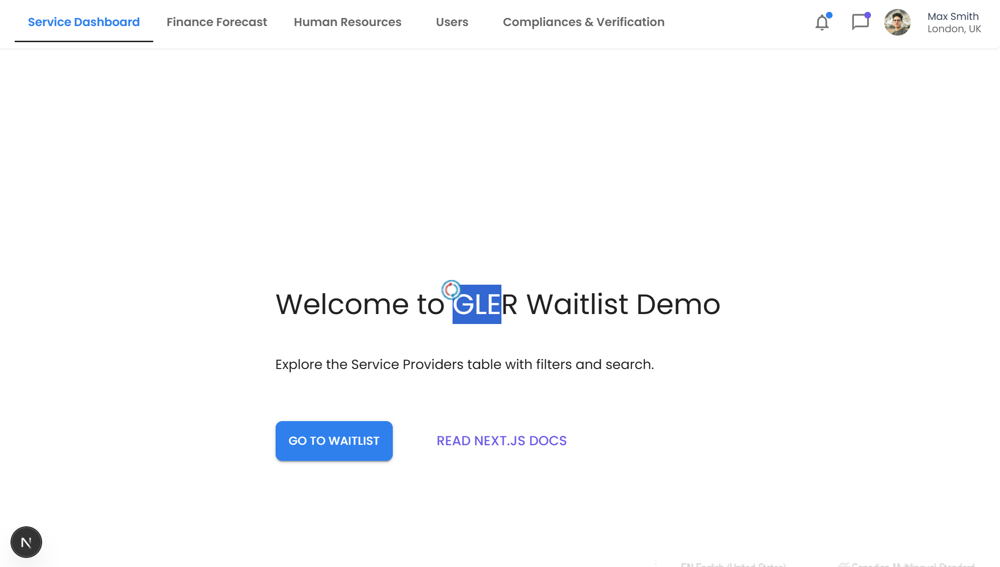
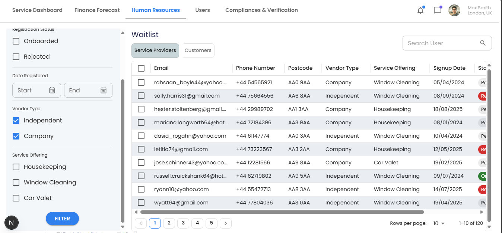

GLER Waitlist Dashboard
=======================

A simple, friendly dashboard to explore and manage a list of service providers. It follows the provided design and works well on laptops, tablets, and phones.

Screenshots
-----------

Home



Waitlist



What You Can Do (Non‑technical)
--------------------------------

- Browse a list of providers with clean columns for Email, Phone, Postcode, Vendor Type, Service Offering, Signup Date and Status.
- Search by email, phone or postcode and filter by status, vendor type, offering and date range.
- Change the number of rows shown per page (10, 25, or 50). At 10 rows the table grows to fit, so you don’t need to scroll; 25/50 use a scroll for faster performance.
- Move between pages using the simple arrow‑and‑numbers pager.
- Open the details dialog from the actions column (demo only).
- Navigate using the header tabs. “Service Dashboard” takes you to the home page.

Quick Start (For Reviewers)
---------------------------

Prerequisites

- Node.js 18.18+ (or 20+ recommended)

Install and run

```
npm install
npm run dev
```

Open `http://localhost:3000` (home) and `http://localhost:3000/waitlist` for the main dashboard.

Tech Stack (At a Glance)
------------------------

- Next.js App Router, React 19, TypeScript
- Material UI (MUI) v7 + DataGrid for the table
- Day.js for dates, Axios for HTTP, Faker for demo data

How Data Works
--------------

- The app exposes a demo API at `/api/service-providers` that returns seeded data generated with Faker (see `src/lib/seed.ts`).
- The data is cached in memory for the process lifetime. Restarting the dev server recreates the dataset.

Key Features (Technical)
------------------------

- Fast client‑side filtering with a single pass over a pre‑indexed dataset (lowercased fields and date epochs).
- Row‑level editing with format validation for email, phone and postcode; controlled select fields for vendor/offering/status.
- Controlled pagination model; custom compact footer with Figma‑style numeric pager on the left and MUI’s rows‑per‑page selector on the right.
- Auto‑height at 10 rows to avoid scroll; internal virtual scroll at 25/50.
- Responsive layout using CSS grid and MUI breakpoints; table header stays visible.

Project Structure
-----------------

- `src/app/waitlist/page.tsx` — Assembles the page, loads data, applies filters.
- `src/components/filters/FiltersPanel.tsx` — Filter UI and state shape.
- `src/components/waitlist/WaitlistHeader.tsx` — Title, entity toggle, search input.
- `src/components/table/ServiceProvidersTable.tsx` — DataGrid with editing and pagination.
- `src/components/table/CustomGridFooter.tsx` — Footer hosting the pager and MUI selector.
- `src/components/pagination/PaginationTabs.tsx` — Reusable arrow + numbers pager.
- `src/components/layout/AppHeader.tsx` — Top navigation.
- `src/app/api/service-providers/route.ts` — In‑memory API endpoint.
- `src/lib/seed.ts` — Deterministic data generation.

Available Scripts
-----------------

- `npm run dev` — start the dev server
- `npm run build` — create a production build
- `npm start` — run the production build
- `npm run preview` — build then start
- `npm run lint` — run ESLint

Using the App
-------------

1. Go to `/waitlist`.
2. Try the search bar or any combination of filters on the left.
3. Edit a row: double‑click or use the row edit action; invalid formats are rejected.
4. Change rows per page (10/25/50) and navigate with the numeric pager.
5. Open a details dialog from the actions column (demo only).

Notes & Next Steps
------------------

- This is a front‑end demo. Real apps would save edits to a backend.
- Nice enhancements to consider:
  - Ellipsis in the pager for very large page counts.
  - Persist filters and pagination to the URL so the state is shareable.
  - Server‑side pagination when the dataset becomes large.
  - Unit tests for filter logic and pager math.
